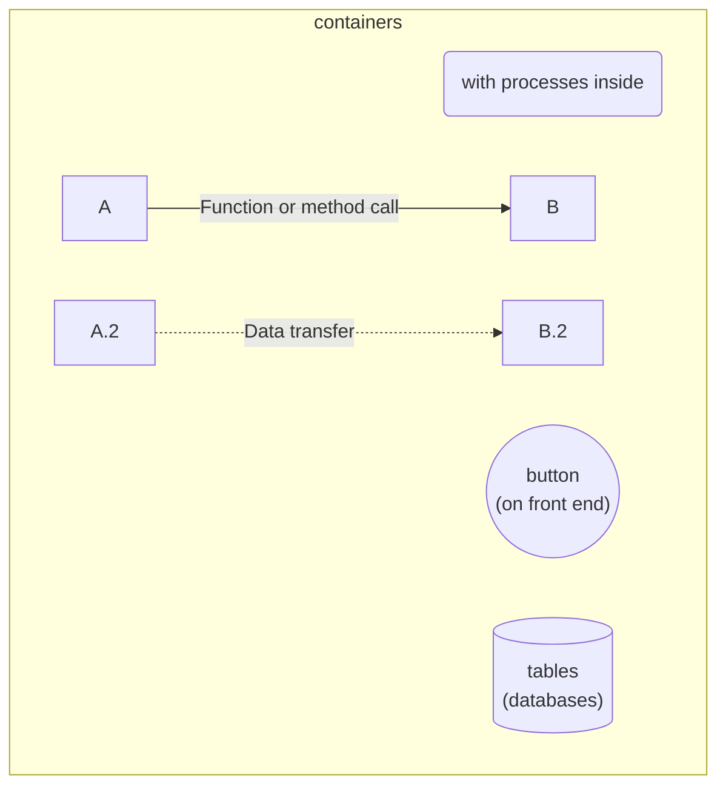
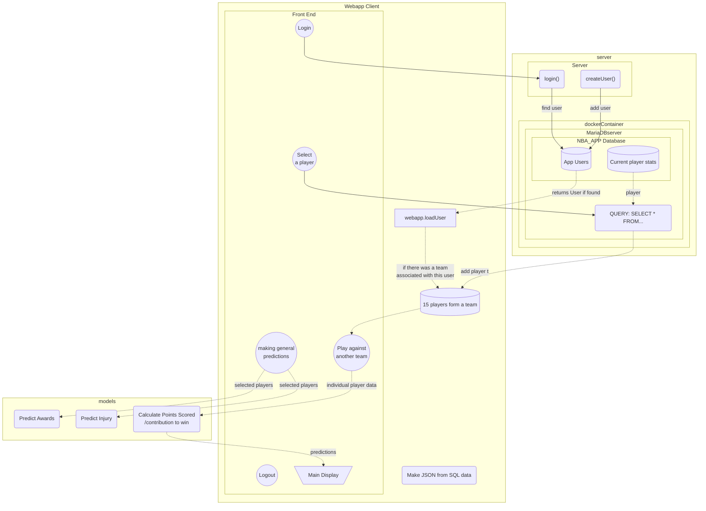
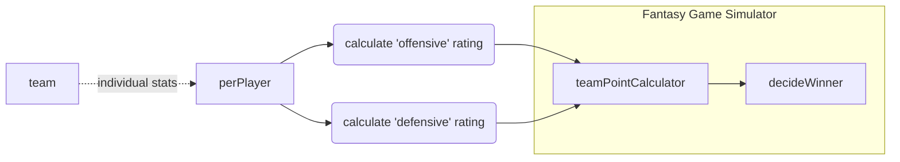

# General Project Flow
## Legend

```mermaid
graph TD 
subgraph containers
  process(with processes inside)
  button(("button<br>(on front end)"))
  database[("tables<br>(databases)")]
  A--Function or method call-->B
  A.2-.Data transfer .->B.2
end
```

```mermaid
graph TD

subgraph server
  subgraph Server
    server.login("login()")
    server.createUser("createUser()")
  end

  subgraph dockerContainer
    subgraph MariaDBserver
      subgraph NBA_APP Database
        nba_app.users[(App Users)]
        nba_app.playerStats[(Current player stats)]
      end
      findPlayer("QUERY: SELECT * FROM...")
    end
  end
end
nba_app.playerStats-.player.->findPlayer
server.login--find user--> nba_app.users -.returns User if found.->webapp.loadUser
server.createUser--add user-->nba_app.users
subgraph Webapp Client
  subgraph Front End
    webapp.login(("Login"))
    webapp.logout(("Logout"))
    webapp.selectPlayer(("Select<br>a player"))
    webapp.simulate(("Play against<br>another team"))
    webapp.generalPredictions(("making general<br>predictions"))
    webapp.mainDisplay[\Main Display/]
  end
  webapp.loadUser
  webapp.team[("15 players form a team<br>")]
  webapp.makejson(Make JSON from SQL data)
end
webapp.generalPredictions-.selected players.->models.awardPredictions
webapp.generalPredictions-.selected players.->models.injuryPredictions
webapp.login-->server.login
webapp.loadUser-.if there was a team<br>associated with this user.->webapp.team
webapp.team-.->webapp.simulate-.individual player data-.->models.gameSimulator
webapp.selectPlayer-->findPlayer-.add player to.->webapp.team
subgraph models
  models.awardPredictions(Predict Awards)
  models.injuryPredictions(Predict Injury)
  models.gameSimulator(Calculate Points Scored<br>/contribution to win)
end
models.gameSimulator-.predictions.->webapp.mainDisplay

```

# Game Simulator Model

```mermaid
graph LR
team-.individual stats.->perPlayer-->c1(calculate 'offensive' rating)-->teamPointCalculator

perPlayer --> c2(calculate 'defensive' rating)-->teamPointCalculator

subgraph Fantasy Game Simulator
  teamPointCalculator-->decideWinner
end
```
