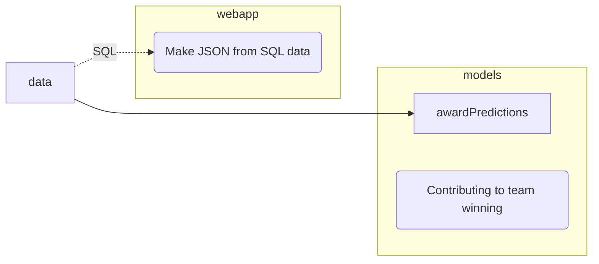
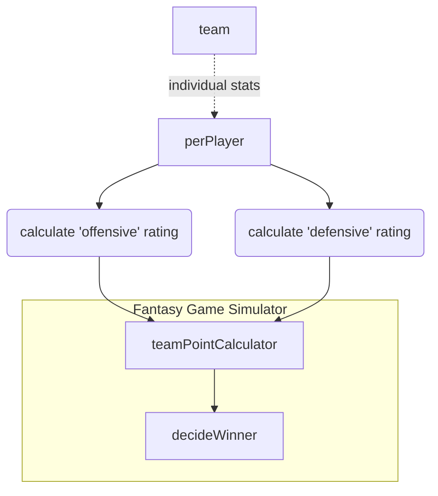
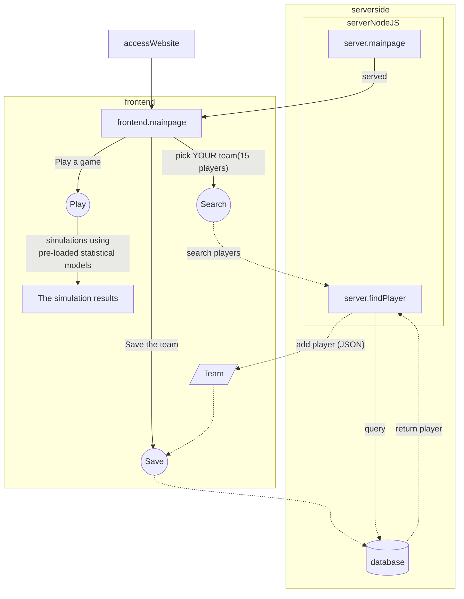

# General Project Flow

```mermaid
graph LR
subgraph webapp
  webapp.makejson(Make JSON from SQL data)
end
subgraph models
awardPredictions
playerPerformance(Contributing to team winning)
end
data -.SQL.-> webapp.makejson
data ---> awardPredictions
```

# Game Simulator Model

```mermaid
graph TD
team-.individual stats.->perPlayer-->c1(calculate 'offensive' rating)-->teamPointCalculator

perPlayer --> c2(calculate 'defensive' rating)-->teamPointCalculator

subgraph Fantasy Game Simulator
  teamPointCalculator-->decideWinner
end
```

# Web App breakdown

```mermaid
graph TD

accessWebsite --> frontend.mainpage
server.mainpage --served-->frontend.mainpage

subgraph frontend
frontend.mainpage--"pick YOUR team(15 players)"-->searchPlayer
frontend.mainpage--Save the team-->saveTeam
frontend.mainpage--Play a game -->play
searchPlayer((Search))
saveTeam((Save))
play(("Play"))--simulations using<br>pre-loaded statistical models-->results
team[/Team/]
results[The simulation results]
end

saveTeam -..->database
team-..->saveTeam
searchPlayer-.search players.->server.findPlayer
server.findPlayer -."add player (JSON)".->team
server.findPlayer -. query .-> database
database -.return player.-> server.findPlayer

subgraph serverside
database[(database)]
  subgraph serverNodeJS
    server.mainpage
    server.findPlayer
  end
end


```