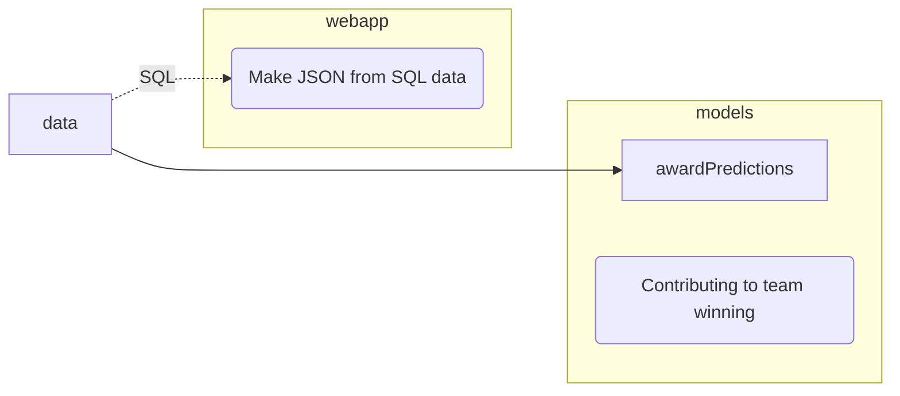
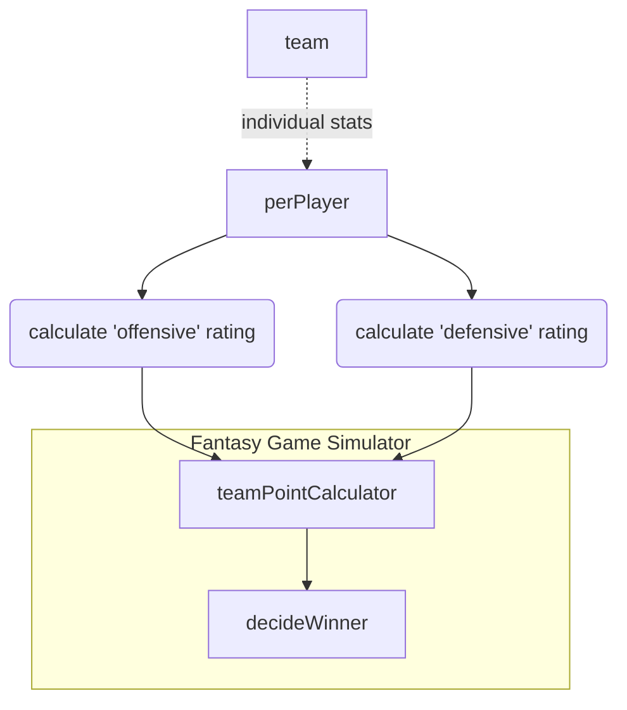

# General Project Flow

```mermaid
graph LR
subgraph webapp
  webapp.makejson(Make JSON from SQL data)
end
subgraph models
awardPredictions
playerPerformance(Contributing to team winning)
end
data -.SQL.-> webapp.makejson
data ---> awardPredictions
```

# Game Simulator Model

```mermaid
graph TD
team-.individual stats.->perPlayer-->c1(calculate 'offensive' rating)-->teamPointCalculator

perPlayer --> c2(calculate 'defensive' rating)-->teamPointCalculator

subgraph Fantasy Game Simulator
  teamPointCalculator-->decideWinner
end
```

# Fantasy League Model
```mermaid
graph TD


```